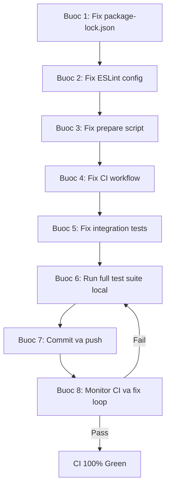

# Fix CI/CD va Dam bao GitHub Actions Pass 100%

## Hien trang sau khi review

Phase 5 da implement: ESLint, Husky, GitHub Actions workflow, package metadata. Tuy nhien, co **7 loi nghiem trong** se khien CI fail ngay lap tuc khi push len GitHub.

---

## Loi phat hien (sap xep theo muc do nghiem trong)

### LOI 1 - CRITICAL: `npm ci` se fail vi thieu `package-lock.json`

[.gitignore](.gitignore) dong 3 chua `package-lock.json`, nhung CI workflow ([.github/workflows/ci.yml](.github/workflows/ci.yml) dong 26) dung `npm ci` - command nay **bat buoc** phai co `package-lock.json`.

```
# Hien tai trong .gitignore:
package-lock.json    <-- CI fail ngay tai buoc nay
```

**Fix:** Xoa `package-lock.json` khoi `.gitignore`, chay `npm install` de tao lai file, va commit no.

### LOI 2 - CRITICAL: ESLint `sourceType: "module"` khong tuong thich voi CommonJS

[.eslintrc.json](.eslintrc.json) dong 11 dat `"sourceType": "module"`, nhung **toan bo** project dung CommonJS (`require()`, `module.exports`). ESLint se bao loi moi file khi chay `npm run lint`.

```json
// Hien tai (SAI):
"sourceType": "module"

// Can doi thanh:
"sourceType": "commonjs"
```

### LOI 3 - HIGH: `prepare: "husky"` se fail trong CI

[package.json](package.json) dong 17: `"prepare": "husky"`. Trong GitHub Actions, `npm ci` se tu dong chay `prepare` script. Neu `.git` directory khong hop le hoac husky chua setup, se fail.

**Fix:** Doi thanh `"prepare": "husky || true"` de khong fail khi chay trong CI.

### LOI 4 - HIGH: Playwright can `--with-deps` trong Ubuntu CI

[.github/workflows/ci.yml](.github/workflows/ci.yml) dong 30: `npx playwright install firefox` se cai browser binary nhung **thieu system dependencies** tren Ubuntu (libgtk, libasound, etc.).

**Fix:** Doi thanh `npx playwright install --with-deps firefox`.

### LOI 5 - MEDIUM: Integration test phu thuoc network

[tests/integration/browser-session.test.js](tests/integration/browser-session.test.js) dong 35, 46: Navigate toi `https://example.com` - phu thuoc mang ngoai. Trong CI, co the timeout hoac bi block.

**Fix:** Them timeout cho `page.goto()` va them error handling. Hoac chuyen sang dung local HTML thay vi URL ngoai.

### LOI 6 - MEDIUM: Test timeout co the khong du cho CI

[jest.config.js](jest.config.js) dong 7: `testTimeout: 30000` (30s). Tren GitHub Actions runner (chia se tai nguyen), browser tests co the can nhieu thoi gian hon.

**Fix:** Tang len 60000ms (60s).

### LOI 7 - LOW: ESLint env `browser: true` khong can thiet

[.eslintrc.json](.eslintrc.json) dong 6: `"browser": true` - khong can thiet cho Node.js project, co the gay nhieu globals khong mong muon.

**Fix:** Xoa `"browser": true`.

---

## Ke hoach thuc hien (theo thu tu)

### Buoc 1: Fix `package-lock.json` issue

1. Xoa dong `package-lock.json` khoi `.gitignore`
2. Chay `npm install` de tao/cap nhat `package-lock.json`
3. Verify: `ls -la package-lock.json` - file phai ton tai

### Buoc 2: Fix ESLint config

1. Doi `"sourceType": "module"` thanh `"sourceType": "commonjs"` trong `.eslintrc.json`
2. Xoa `"browser": true` khoi `env`
3. Chay `npm run lint` va kiem tra log output
4. Neu co loi, chay `npm run lint:fix` de auto-fix
5. Xu ly cac loi khong the auto-fix bang tay
6. Verify: `npm run lint` phai exit code 0

### Buoc 3: Fix `prepare` script trong `package.json`

1. Doi `"prepare": "husky"` thanh `"prepare": "husky || true"`
2. Verify: script khong fail khi chay trong env khong co `.git`

### Buoc 4: Fix GitHub Actions workflow

1. Doi `npx playwright install firefox` thanh `npx playwright install --with-deps firefox`
2. Verify: xem lai toan bo workflow logic

### Buoc 5: Fix integration tests cho CI

1. Tang `testTimeout` trong `jest.config.js` tu 30000 len 60000
2. Them timeout option cho `page.goto()` trong `browser-session.test.js`
3. Xem xet them `jest.retryTimes(2)` cho integration tests
4. Verify: chay `npm run test:integration` va kiem tra pass

### Buoc 6: Chay toan bo test suite local

1. Chay `npm test` - kiem tra tat ca 55+ tests pass
2. Chay `npm run lint` - kiem tra ESLint pass
3. Kiem tra log output khong co warnings/errors bat thuong
4. Verify: exit code 0 cho ca hai commands

### Buoc 7: Commit va push len GitHub

1. `git add .`
2. `git commit -m "fix: CI/CD compatibility - eslint config, package-lock, playwright deps"`
3. `git push origin main`
4. Verify: kiem tra GitHub Actions tab

### Buoc 8: Monitor GitHub Actions va fix neu can

1. Mo GitHub Actions tab, theo doi CI run
2. Neu fail: doc log, xac dinh loi, fix, push lai
3. Lap lai cho den khi CI pass 100%
4. Verify: green checkmark tren ca 2 matrix (Node 18 va Node 20)

---

## Thu tu thuc hien




## Luu y quan trong

- **Buoc 1 la toi quan trong nhat** - khong co `package-lock.json`, CI fail ngay tai buoc dau tien
- **Buoc 2 la loi lon thu hai** - ESLint voi sai sourceType se fail moi file
- Buoc 6 phai chay TRUOC khi push de tranh push code loi
- Buoc 8 co the can lap lai nhieu lan neu phat hien loi moi tren CI environment
- Moi buoc deu can kiem tra log output can than truoc khi chuyen sang buoc tiep theo

