# Phase 3: Nghiem Thu Phase 2 va Hoan Thien Du An

## 1. Ket qua nghiem thu Phase 2

### Da hoan thanh tot (13/16 hang muc)

- A1: Fix TaskRunner singleton - OK (`scrape.js` dong 88 dung `require` khong `new`)
- A2: Fix headless default - OK (`config/default.js` dong 24: `!== 'false'`)
- A4: Lock p-limit - OK (`"p-limit": "3.1.0"`)
- B1: `.gitignore` - OK
- B2: `page-actions.js` - OK (10 ham day du)
- B3: Sample configs - OK (4 file trong `examples/`)
- B4: Unit tests - OK (6 file nhung co bug mock path)
- C1: Session command - OK (list/info/delete/validate)
- C2: Proxy command - OK (list/test/add/remove)
- C3: Graceful shutdown - OK (SIGINT/SIGTERM trong `index.js`)
- D1: Git init - OK
- D2: README update - OK (nhung project structure chua cap nhat)
- D3: CHANGELOG - OK (nhung sai nam)

### Con ton dong (3 hang muc + bug phat hien them)

**C4 (Progress bar)**: Chua thuc hien. `cli-progress` khong co trong `package.json`, khong co code progress bar.

**C5 (Retry trong scrape)**: Chua tich hop. `scrape.js` khong dung `runWithRetry()`, khong co option `--retry`.

**Bug: Test mock paths sai** - Tat ca 6 file test dung `jest.doMock('../logger/logger')` nhung tu `tests/unit/` path nay resolve den `tests/logger/logger` (khong ton tai), khong phai `src/logger/logger`. Can doi thanh `jest.doMock('../../src/logger/logger')`.

**Bug: BrowserManager tai-launch browser** - `createBrowserSession()` luon goi `launchBrowser()` de thay the `this.browser`. Khi chay nhieu task song song, browser cu bi mat reference nhung van chay -> memory leak.

**Bug: run.js test step co ban** - `executeTest()` chi xu ly `title` check, khong dung cac check types khac (selector, text, attribute, visible, evaluate).

---

## 2. Cong viec Phase 3

### Phase E: Sua loi ton dong tu Phase 2

**E1. Fix tat ca test mock paths**

6 files trong `tests/unit/`: thay `jest.doMock('../logger/logger')` bang `jest.doMock('../../src/logger/logger')` de mock dung module logger.

Files can sua:

- [tests/unit/session-manager.test.js](tests/unit/session-manager.test.js)
- [tests/unit/proxy-manager.test.js](tests/unit/proxy-manager.test.js)
- [tests/unit/storage.test.js](tests/unit/storage.test.js)
- [tests/unit/stealth.test.js](tests/unit/stealth.test.js)
- [tests/unit/user-agents.test.js](tests/unit/user-agents.test.js)
- [tests/unit/human-behavior.test.js](tests/unit/human-behavior.test.js)

**E2. Implement C4: Progress bar cho task runner**

- Them `cli-progress` vao `package.json` dependencies
- Tao helper `src/utils/progress.js` boc cli-progress API
- Tich hop vao `task-runner.js` method `runParallel()` va `runWithRetry()`
- Hien thi: `[====>    ] 4/10 tasks | 2 passed | 1 failed | ETA: 30s`

**E3. Implement C5: Retry logic trong scrape command**

File: [src/cli/commands/scrape.js](src/cli/commands/scrape.js)

- Them option `--retry <n>` (default: 0)
- Khi `retry > 0` va `parallel > 1`: dung `taskRunner.runWithRetry()` thay vi `runWithProxies()`
- Khi `retry > 0` va `parallel = 1`: wrap vong lap scrape trong try/catch voi retry count

**E4. Fix CHANGELOG date va README project structure**

- [CHANGELOG.md](CHANGELOG.md): doi `2024-02-16` thanh `2026-02-16`
- [README.md](README.md): cap nhat project structure them:
  - `src/cli/commands/session.js`, `proxy.js`
  - `src/core/page-actions.js`
  - `tests/unit/` directory
  - `jest.config.js`, `CHANGELOG.md`

### Phase F: Sua loi ky thuat phat hien them

**F1. Fix BrowserManager khong tai-launch browser khi da co**

File: [src/core/browser-manager.js](src/core/browser-manager.js)

Sua `createBrowserSession()` de tai su dung browser da launch:

```javascript
async createBrowserSession(options = {}) {
  if (!this.browser || !this.browser.isConnected()) {
    await this.launchBrowser(options);
  }
  const context = await this.createContext(options);
  const page = await this.createPage(context);
  return { browser: this.browser, context, page };
}
```

**F2. Nang cap run.js executeTest de dung day du check types**

File: [src/cli/commands/run.js](src/cli/commands/run.js)

Thay ham `executeTest()` (hien chi co title check) bang logic tuong tu `test.js` command - ho tro tat ca check types: title, status, selector, text, attribute, visible, evaluate.

**F3. Them auto-create directories khi khoi dong**

File: [config/default.js](config/default.js) hoac [src/index.js](src/index.js)

Dam bao `data/sessions/`, `data/output/`, `data/logs/` duoc tao tu dong khi chua ton tai (dung `fs.mkdirSync(dir, { recursive: true })`).

### Phase G: Testing va Chat luong

**G1. Chay tat ca unit tests va fix failures**

- Chay `npm test` sau khi fix mock paths
- Fix bat ky test nao fail
- Dam bao tat ca 6 file test pass

**G2. Them integration tests**

Tao `tests/integration/` voi cac test:

- `browser-session.test.js`: Test launch browser -> tao context -> inject stealth -> dong
- `cli-commands.test.js`: Test CLI commands output (dung child_process.exec)

**G3. Them input validation cho config files**

- Validate scrape config JSON schema (phai co `url` hoac `urls`)
- Validate task config JSON schema
- Validate proxy format truoc khi add
- Hien thi loi ro rang khi config khong hop le

### Phase H: Documentation va Finalize

**H1. Bo sung README sections**

- **Troubleshooting**: Cac loi thuong gap (Playwright install, proxy timeout, session expired)
- **Development Guide**: Huong dan chay tests, project structure chi tiet, coding conventions
- **API Reference**: Mo ta cac core module va cach su dung

**H2. Verify npm link va global install**

- Chay `npm link` va test `autobot --help` tu global
- Verify tat ca commands hoat dong tu global install
- Test shebang line (`#!/usr/bin/env node`) hoat dong dung

**H3. Git commit final**

- Stage tat ca thay doi
- Commit voi message phu hop
- Tag version v1.0.0

---

## 3. Thu tu thuc hien

```mermaid
flowchart LR
    subgraph phaseE [Phase E: Fix ton dong]
        E1[Fix_test_mocks]
        E2[Progress_bar]
        E3[Retry_scrape]
        E4[Fix_docs]
    end

    subgraph phaseF [Phase F: Fix bugs]
        F1[Fix_BrowserManager]
        F2[Fix_run_test_step]
        F3[Auto_create_dirs]
    end

    subgraph phaseG [Phase G: Testing]
        G1[Run_fix_tests]
        G2[Integration_tests]
        G3[Input_validation]
    end

    subgraph phaseH [Phase H: Finalize]
        H1[README_sections]
        H2[npm_link_verify]
        H3[Git_commit_final]
    end

    phaseE --> phaseF --> phaseG --> phaseH
```




## 4. Dependencies moi

- `cli-progress`: Progress bar cho parallel tasks (Phase E2)
- Khong can them dependency nao khac

