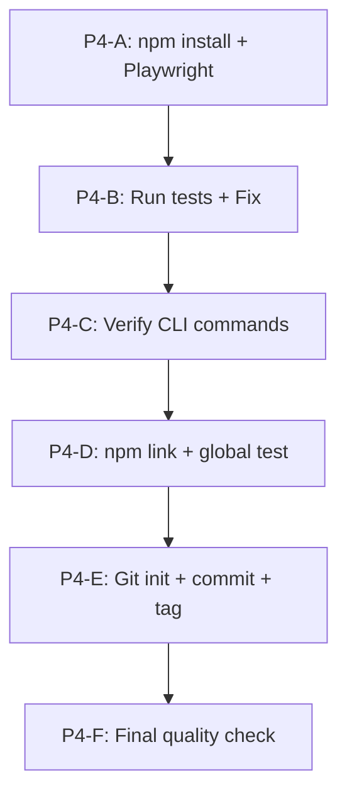

# Phase 4: Cai Dat, Testing va Ship Du An

## Hien trang

- Tat ca 13 hang muc code cua Phase 3 da duoc implement
- **Chua co `node_modules/**` - dependencies chua duoc cai dat
- **Chua co `.git/**` - git repo chua khoi tao
- Cac hang muc G1, H2, H3 chua the verify vi thieu dependencies va git

---

## Cong viec Phase 4

### P4-A: Cai dat dependencies va Playwright

1. Chay `npm install` de cai tat ca dependencies
2. Chay `npx playwright install firefox` de cai browser Firefox cho Playwright
3. Tao file `.env` tu `.env.example` voi cac gia tri mac dinh phu hop

Files lien quan:

- [package.json](package.json) - da co day du dependencies
- [.env.example](.env.example) - template

### P4-B: Chay tat ca tests va fix loi

1. Chay `npm test` de chay tat ca unit + integration tests
2. Neu co test failures:
  - Phan tich loi
  - Fix tung test case
  - Chay lai cho den khi tat ca pass
3. Chay `npm run test:unit` va `npm run test:integration` rieng de dam bao

Files lien quan:

- [jest.config.js](jest.config.js) - test configuration
- `tests/unit/*.test.js` - 6 unit test files
- `tests/integration/*.test.js` - 2 integration test files

### P4-C: Verify CLI commands hoat dong

1. Test truc tiep `node src/index.js --help` - kiem tra CLI output
2. Test `node src/index.js session list` - kiem tra session command
3. Test `node src/index.js proxy list` - kiem tra proxy command
4. Test `node src/index.js scrape --help` - kiem tra options
5. Test `node src/index.js run --help` - kiem tra run command

File lien quan:

- [src/index.js](src/index.js) - CLI entry point

### P4-D: npm link va verify global install

1. Chay `npm link` de cai global
2. Test `autobot --help` tu terminal
3. Test `autobot session list`
4. Test `autobot proxy list`
5. Verify shebang line hoat dong (`#!/usr/bin/env node` trong [src/index.js](src/index.js))

### P4-E: Khoi tao Git va commit

1. `git init` - khoi tao repo
2. Kiem tra `.gitignore` da cover tat ca files can thiet:
  - node_modules/, data/, .env, coverage/, .DS_Store
3. `git add .` - stage tat ca files
4. `git commit -m "feat: v1.0.0 - Playwright CLI Automation Tool"` voi commit message mo ta day du
5. `git tag v1.0.0` - tag version

File lien quan:

- [.gitignore](.gitignore) - da co day du patterns

### P4-F: Kiem tra chat luong cuoi cung

1. Verify khong co secrets/credentials trong code (kiem tra .env khong bi commit)
2. Verify `package.json` co day du metadata (author, license, description, keywords)
3. Kiem tra tat ca file co shebang dung
4. Kiem tra README.md render dung (markdown format)
5. Review CHANGELOG.md lan cuoi

---

## Thu tu thuc hien

## Luu y

- Neu integration tests can browser that (Playwright), can dam bao Firefox da cai qua `npx playwright install firefox`
- Neu `npm link` gap loi permission, co the can `sudo npm link` hoac dung nvm
- Tat ca loi phat hien trong buoc B se duoc fix ngay truoc khi chuyen sang buoc tiep theo

