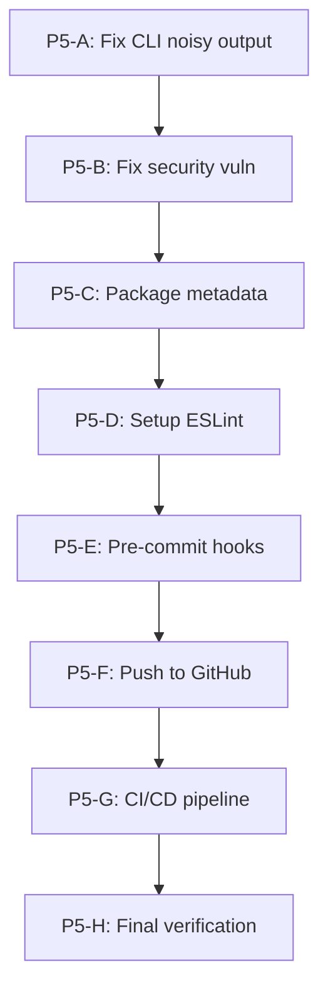

# Phase 5: Production-Ready va Distribution

## Ket qua nghiem thu Phase 4

Tat ca 6 hang muc P4-A den P4-F da hoan thanh:

- 55/55 tests pass (8 test suites)
- CLI hoat dong day du (login, scrape, test, run, session, proxy)
- `npm link` + `autobot` global command OK
- Git repo initialized, committed, tagged v1.0.0

### Van de phat hien

1. **CLI output noisy**: Moi khi chay bat ky command nao, 3-4 dong warning/info log hien ra (proxy loaded: 0, email not configured, slack not configured). Day la do [src/logger/logger.js](src/logger/logger.js) va [src/notifier/notifier.js](src/notifier/notifier.js) log o muc info/warn khi khoi tao. Can chuyen sang log level `debug` hoac chi log khi thuc su can.
2. `**package.json` thieu metadata**: Field `author` dang trong, khong co `repository`, `homepage`, `bugs` fields.
3. **npm audit vulnerability**: 1 high severity vulnerability can fix.
4. **Khong co code quality tools**: Chua co ESLint, chua co pre-commit hooks.
5. **Chua co remote repository**: Code chi o local.
6. **Chua co CI/CD**: Khong co automated testing khi push code.

---

## Cong viec Phase 5

### P5-A: Fix CLI Output Noisy

**Van de**: Moi command deu in ra:

```
info: Total proxies loaded: 0
warn: Email notifier not configured - missing SMTP credentials
warn: Slack notifier not configured - missing webhook URL
info: Notifier initialized with channels: none
```

**Giai phap**: 

- Trong [src/proxy/proxy-manager.js](src/proxy/proxy-manager.js): chuyen log "Total proxies loaded" tu `info` sang `debug`
- Trong [src/notifier/notifier.js](src/notifier/notifier.js): chuyen cac warning "not configured" sang `debug` (day la tinh nang optional, khong phai loi)
- Trong [src/notifier/email.js](src/notifier/email.js) va [src/notifier/slack.js](src/notifier/slack.js): tuong tu chuyen sang debug

### P5-B: Fix Security Vulnerability

- Chay `npm audit` de xac dinh chinh xac vulnerability
- Chay `npm audit fix` hoac update dependency cu the
- Verify lai tests sau khi fix

### P5-C: Cap nhat Package Metadata

File: [package.json](package.json)

- Them `author` field
- Them `repository` field (URL GitHub)
- Them `homepage` field
- Them `bugs` field
- Them `files` field de chi dinh files nao duoc include khi npm publish: `["src/", "config/", "examples/", "README.md", "CHANGELOG.md", "LICENSE"]`
- Them script `prepublishOnly`: `"npm test"`

### P5-D: Setup ESLint

- Cai dat `eslint` vao devDependencies
- Tao file cau hinh `.eslintrc.json` voi rules phu hop cho Node.js project
- Them script `lint` va `lint:fix` vao package.json
- Chay lint, fix cac loi neu co
- Khong can Prettier (giu don gian)

### P5-E: Setup Pre-commit Hooks (Husky + lint-staged)

- Cai dat `husky` va `lint-staged` vao devDependencies
- Cau hinh husky pre-commit hook chay `lint-staged`
- Cau hinh lint-staged chay ESLint tren staged `.js` files
- Dam bao hook hoat dong khi commit

### P5-F: Tao GitHub Repository va Push

- Tao repository tren GitHub (dung `gh repo create`)
- Them remote origin
- Push code len GitHub
- Verify repository hien thi dung tren GitHub

### P5-G: Setup GitHub Actions CI/CD

Tao file `.github/workflows/ci.yml`:

- Trigger: push va pull_request tren branch main
- Steps: checkout, setup Node.js 18, npm install, npx playwright install firefox, npm test, npm run lint
- Matrix test voi Node 18 va 20

### P5-H: Final Verification va Release

- Chay toan bo test suite lan cuoi
- Verify ESLint pass
- Verify CI/CD pipeline chay thanh cong tren GitHub
- Cap nhat CHANGELOG.md voi Phase 5 changes
- Git commit va tag v1.0.1
- (Optional) npm publish neu muon share len npm registry

---

## Thu tu thuc hien




## Luu y

- P5-A la uu tien cao nhat vi anh huong truc tiep UX cua CLI tool
- P5-F can co GitHub account va `gh` CLI tool (GitHub CLI) da cai dat
- P5-G se tu dong chay tests khi push code - dam bao tests pass truoc
- Neu khong can npm publish, co the bo qua phan `files` va `prepublishOnly` trong P5-C

