# Ke hoach Phase 2: Nghiem thu va Hoan thien du an Playwright CLI

## 1. Ket qua nghiem thu Phase 1

### Da hoan thanh (12 modules)

Tat ca 12 phase trong plan truoc da duoc trien khai day du voi cau truc thu muc dung, bao gom:

- Entry point CLI (`src/index.js`) voi 4 commands: login, scrape, test, run
- Core modules: browser-manager, task-runner
- Feature modules: session-manager, stealth, user-agents, human-behavior, proxy-manager, scraper
- Infrastructure: logger (Winston), notifier (email + slack), storage (JSON/CSV)
- Config: `config/default.js`, `.env.example`, `ecosystem.config.js`, `README.md`

### Cac van de phat hien

#### Bug 1: TaskRunner singleton vs class instantiation

Trong `src/cli/commands/scrape.js` (dong 95), code tao `new TaskRunner()` nhung `src/core/task-runner.js` export la singleton instance (`module.exports = new TaskRunner()`), khong phai class. Dieu nay se gay loi runtime.

```95:99:src/cli/commands/scrape.js
const TaskRunner = require('../../core/task-runner');
const taskRunner = new TaskRunner();
```

**Fix:** Su dung truc tiep singleton instance thay vi tao new.

#### Bug 2: Browser headless default sai

Trong `config/default.js` (dong 23):

```23:23:config/default.js
headless: process.env.BROWSER_HEADLESS === 'true',
```

Khi khong set bien moi truong, `BROWSER_HEADLESS` la `undefined`, nen `=== 'true'` tra ve `false` -> trinh duyet se chay headful mac dinh. Can doi thanh default `true` (headless).

#### Bug 3: TaskRunner.runWithProxies goi this.executeTask nhung loi reference

`runWithProxies` trong `task-runner.js` goi `this.executeTask(taskOptions)` nhung ham `executeTask` require `browser-manager` dong bo (lazy require). Khi chay song song, moi task se tao browser rieng thay vi share browser -> ton tai nguyen. Can refactor.

#### Bug 4: p-limit import style

`p-limit` v3.x dung CommonJS nhung v4+ chuyen sang ESM. `package.json` khai bao `"p-limit": "^3.1.0"` la dung. Tuy nhien can lock version de tranh tu dong update len v4.

### Cac file/tinh nang con thieu


| Hang muc                   | Trang thai                                |
| -------------------------- | ----------------------------------------- |
| `.gitignore`               | Chua tao                                  |
| `src/core/page-actions.js` | Chua tao (co trong plan goc)              |
| Thu muc `tests/`           | Chua tao (package.json da co scripts)     |
| Sample config files        | Chua tao (examples cho scrape, test, run) |
| Git repository             | Chua khoi tao                             |
| `data/` subdirectories     | Can xac nhan ton tai                      |


---

## 2. Cong viec can thuc hien

### Phase A: Sua loi ky thuat (Critical Bugs)

**A1. Fix TaskRunner singleton bug trong scrape.js**

File: `src/cli/commands/scrape.js`

Thay doi dong 95-96:

```javascript
// Truoc (SAI)
const TaskRunner = require('../../core/task-runner');
const taskRunner = new TaskRunner();

// Sau (DUNG)
const taskRunner = require('../../core/task-runner');
```

**A2. Fix browser headless default**

File: `config/default.js`

```javascript
// Truoc (SAI - default la headful)
headless: process.env.BROWSER_HEADLESS === 'true',

// Sau (DUNG - default la headless)
headless: process.env.BROWSER_HEADLESS !== 'false',
```

Dong thoi cap nhat `.env.example` de ghi chu ro rang.

**A3. Fix TaskRunner.executeTask de khong tao browser moi cho moi task**

Refactor `src/core/task-runner.js` ham `executeTask` de nhan browser instance tu ben ngoai thay vi tu tao. Them tham so `browserManager` optional.

**A4. Lock p-limit version**

File: `package.json` - Doi `"p-limit": "^3.1.0"` thanh `"p-limit": "3.1.0"` (bo dau `^`).

### Phase B: Bo sung file con thieu

**B1. Tao `.gitignore**`

```
node_modules/
data/sessions/
data/output/
data/logs/
.env
*.log
```

**B2. Tao `src/core/page-actions.js**`

Module cung cap cac thao tac co ban tren page de tai su dung:

- `goto(page, url, options)` - Dieu huong voi retry
- `clickElement(page, selector, options)` - Click voi wait va retry
- `fillInput(page, selector, value)` - Dien form voi human-like typing
- `getText(page, selector)` - Lay text content
- `getElements(page, selector)` - Lay danh sach elements
- `waitForPage(page, options)` - Doi trang load xong
- `screenshot(page, path)` - Chup man hinh
- `scrollToBottom(page)` - Cuon xuong cuoi trang

Tich hop stealth/human-behavior vao cac action nay.

**B3. Tao sample config files**

Thu muc: `examples/`

- `examples/scrape-config.json` - Mau cau hinh scraping
- `examples/test-checks.json` - Mau cau hinh kiem thu web
- `examples/task-config.json` - Mau cau hinh task tong hop
- `examples/proxies.txt` - Mau danh sach proxy

**B4. Tao thu muc tests va viet unit tests**

Thu muc: `tests/unit/` va `tests/integration/`

Unit tests (dung Jest):

- `tests/unit/session-manager.test.js` - Test save/load/delete/list session
- `tests/unit/proxy-manager.test.js` - Test load/getNext/getRandom/parse proxy
- `tests/unit/storage.test.js` - Test save/load JSON/CSV
- `tests/unit/user-agents.test.js` - Test getRandom/byPlatform/byBrowser
- `tests/unit/human-behavior.test.js` - Test humanDelay timing
- `tests/unit/stealth.test.js` - Test applyStealthScripts, randomizeViewport

Integration tests:

- `tests/integration/browser-session.test.js` - Test launch browser -> tao context -> inject stealth -> dong

Cau hinh Jest trong `package.json` hoac `jest.config.js`:

```javascript
module.exports = {
  testEnvironment: 'node',
  testMatch: ['**/tests/**/*.test.js'],
  coverageDirectory: 'coverage',
  collectCoverageFrom: ['src/**/*.js'],
};
```

### Phase C: Nang cap tinh nang

**C1. Them lenh `session` de quan ly sessions**

File moi: `src/cli/commands/session.js`

Cac sub-commands:

- `autobot session list` - Liet ke tat ca sessions
- `autobot session info <name>` - Xem chi tiet session
- `autobot session delete <name>` - Xoa session
- `autobot session validate <name>` - Kiem tra session con hop le

SessionManager da co san cac ham `listSessions()`, `getSessionInfo()`, `deleteSession()`, `isSessionValid()` - chi can tao CLI command goi cac ham nay.

**C2. Them lenh `proxy` de quan ly proxy**

File moi: `src/cli/commands/proxy.js`

Cac sub-commands:

- `autobot proxy list` - Liet ke tat ca proxies
- `autobot proxy test` - Test tat ca proxies
- `autobot proxy add <proxy>` - Them proxy moi
- `autobot proxy remove <proxy>` - Xoa proxy

ProxyManager da co san cac ham tuong ung.

**C3. Them Graceful Shutdown**

File: `src/index.js`

Them xu ly tin hieu SIGINT/SIGTERM de dong browser sach se truoc khi thoat:

```javascript
async function gracefulShutdown(signal) {
  logger.info(`Received ${signal}, shutting down...`);
  await browserManager.closeAll();
  process.exit(0);
}
process.on('SIGINT', () => gracefulShutdown('SIGINT'));
process.on('SIGTERM', () => gracefulShutdown('SIGTERM'));
```

**C4. Them Progress Bar cho cac task chay lau**

Su dung thu vien `cli-progress` hien thi tien do khi chay nhieu tasks song song.

**C5. Them Retry logic vao scrape command**

Tich hop `TaskRunner.runWithRetry()` da co san vao scrape command, cho phep tu dong thu lai khi that bai.

### Phase D: Khoi tao Git va Finalize

**D1. Khoi tao Git repository**

```bash
git init
git add .
git commit -m "Initial commit: Playwright CLI Automation v1.0.0"
```

**D2. Cap nhat README.md**

Bo sung:

- Huong dan ve cac lenh `session` va `proxy` moi
- Section "Troubleshooting" voi cac loi thuong gap
- Section "Development" voi huong dan chay tests
- Cap nhat project structure

**D3. Tao CHANGELOG.md**

Ghi nhan phien ban v1.0.0 voi tat ca tinh nang da trien khai.

---

## 3. Thu tu thuc hien

```mermaid
flowchart LR
    subgraph phaseA [Phase A: Sua loi]
        A1[Fix_TaskRunner_singleton]
        A2[Fix_headless_default]
        A3[Refactor_executeTask]
        A4[Lock_p_limit]
    end

    subgraph phaseB [Phase B: Bo sung file]
        B1[Tao_gitignore]
        B2[Tao_page_actions]
        B3[Tao_sample_configs]
        B4[Viet_tests]
    end

    subgraph phaseC [Phase C: Nang cap]
        C1[Lenh_session]
        C2[Lenh_proxy]
        C3[Graceful_shutdown]
        C4[Progress_bar]
        C5[Retry_logic]
    end

    subgraph phaseD [Phase D: Finalize]
        D1[Git_init]
        D2[Update_README]
        D3[CHANGELOG]
    end

    phaseA --> phaseB --> phaseC --> phaseD
```




## 4. Dependencies moi can them

- `cli-progress` - Hien thi progress bar (Phase C4)
- Khong can them dependency khac, cac tinh nang con lai su dung cac module da co

